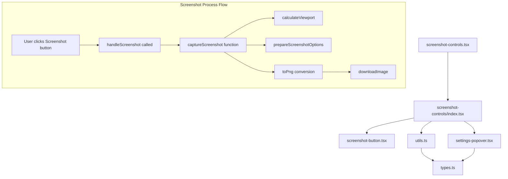

# Schema Editor Screenshot Functionality Documentation

This document provides a comprehensive overview of the screenshot functionality in the Schema Editor application.

## Overview

The screenshot functionality allows users to capture images of their schema designs with automatic sizing based on the schema content itself. The system dynamically calculates the dimensions needed to properly display all schema elements while providing customization options for quality, padding, transparency, and zoom level.

## File Structure

```
screenshot-controls/
├── index.tsx            - Main component coordinating the screenshot process
├── screenshot-button.tsx - UI component for the screenshot button
├── settings-popover.tsx  - UI for screenshot settings configuration
├── types.ts             - Type definitions for screenshot functionality
├── utils.ts             - Core utility functions for capturing screenshots
└── documentation.md     - This documentation file
```

## Component Architecture



## Core Components and Functions

### 1. `index.tsx`

The main controller component that coordinates the screenshot process.

**Key Functions:**
- **`handleScreenshot()`**: Triggered when the user clicks the screenshot button. It orchestrates the screenshot capture process.

**State Management:**
- Manages `isCapturing` state to track when a screenshot is being processed
- Manages `settings` state to store user configuration for screenshots

### 2. `screenshot-button.tsx`

A simple UI component that renders the screenshot button with appropriate loading states.

**Props:**
- `isCapturing`: Boolean to indicate if a screenshot is currently being captured
- `onClick`: Function to trigger when the button is clicked

### 3. `settings-popover.tsx`

Provides the UI for configuring screenshot settings through a popover interface.

**Settings Controlled:**
- Image Quality (1x-4x)
- Content Padding (0-50%)
- Transparent Background toggle
- Auto-fit Schema toggle
- Manual Zoom slider (when Auto-fit is disabled)

### 4. `types.ts`

Defines the TypeScript interfaces used throughout the screenshot functionality.

**Key Types:**
- `ScreenshotSettings`: Interface for user-configurable screenshot settings
- `ScreenshotOptions`: Interface for the options passed to the html-to-image library
- `defaultScreenshotSettings`: Default values for screenshot settings

### 5. `utils.ts`

Contains the core utility functions that power the screenshot functionality.

**Key Constants:**
- `MIN_WIDTH` (800px): Minimum width for screenshots
- `MIN_HEIGHT` (600px): Minimum height for screenshots
- `SCHEMA_PADDING` (100px): Base padding around the schema

**Key Functions:**
- **`downloadImage()`**: Handles saving the captured image to the user's device
- **`getFileName()`**: Generates a filename based on the schema title
- **`calculateViewport()`**: Calculates the optimal viewport dimensions and position based on schema content
- **`prepareScreenshotOptions()`**: Prepares options for the html-to-image library
- **`captureScreenshot()`**: Main function that orchestrates the entire capture process

## Screenshot Process Flow

When a user initiates a screenshot, the following process occurs:

1. User clicks the **Screenshot** button
2. The `handleScreenshot()` function:
   - Sets `isCapturing` state to true
   - Waits a small delay (200ms) to allow UI updates
   - Calls `captureScreenshot()` with the current ReactFlow instance and settings

3. The `captureScreenshot()` function:
   - Retrieves all nodes from the ReactFlow instance
   - Hides UI controls that shouldn't be in the screenshot
   - Calls `calculateViewport()` to determine the ideal dimensions
   - Calls `prepareScreenshotOptions()` to prepare rendering options
   - Uses the `toPng()` function from html-to-image to generate the PNG
   - Calls `downloadImage()` to save the image
   - Restores any hidden UI elements

4. A success toast notification is displayed to the user

## Dynamic Sizing Algorithm

The screenshot functionality uses a smart algorithm to determine the optimal size and positioning:

1. Get the bounds of all nodes using `getNodesBounds()`
2. Calculate dimensions based on node content with additional padding
3. Apply quality multiplier to increase resolution if needed
4. Calculate the center point of the schema content
5. Determine zoom level:
   - If auto-fit is enabled: calculate zoom to fit all content
   - Otherwise: use the user-specified zoom level
6. Calculate viewport position to center the content
7. Return the viewport details for rendering

## Customization Options

Users can customize screenshots through the following options:

| Option | Description | Default |
|--------|-------------|---------|
| Quality | Resolution multiplier (1x-4x) | 2x |
| Padding | Space around schema elements (0-50%) | 25% |
| Transparent Background | Remove background color | Disabled |
| Auto-fit Schema | Automatically size to fit schema | Enabled |
| Manual Zoom | Custom zoom level (0.5x-3.0x) | 1.2x |

## Example Usage Scenario

1. User designs a database schema with multiple tables and relationships
2. User clicks the Screenshot button in the editor toolbar
3. The system:
   - Analyzes all schema elements (tables, relationships)
   - Calculates the optimal viewport to include all elements
   - Applies the user's settings (quality, padding, etc.)
   - Generates the PNG image
   - Automatically downloads the image to the user's device
4. The resulting image contains all schema elements, properly sized and positioned

## Edge Cases Handling

- **Empty Schema**: If no nodes are found, an error message is shown
- **Missing ReactFlow Element**: If the viewport element is not found, an error message is shown
- **Minimum Size**: Images will never be smaller than the defined minimum dimensions (800x600px)
- **Zoom Limits**: Zoom levels are constrained to reasonable values to prevent rendering issues

## Technical Implementation Details

The screenshot functionality utilizes:
- **html-to-image**: For converting DOM elements to PNG images
- **getNodesBounds()**: From XY Flow to calculate schema dimensions
- **ReactFlow viewport manipulation**: For positioning and zooming the view
- **Custom DOM handling**: To hide UI elements during capture